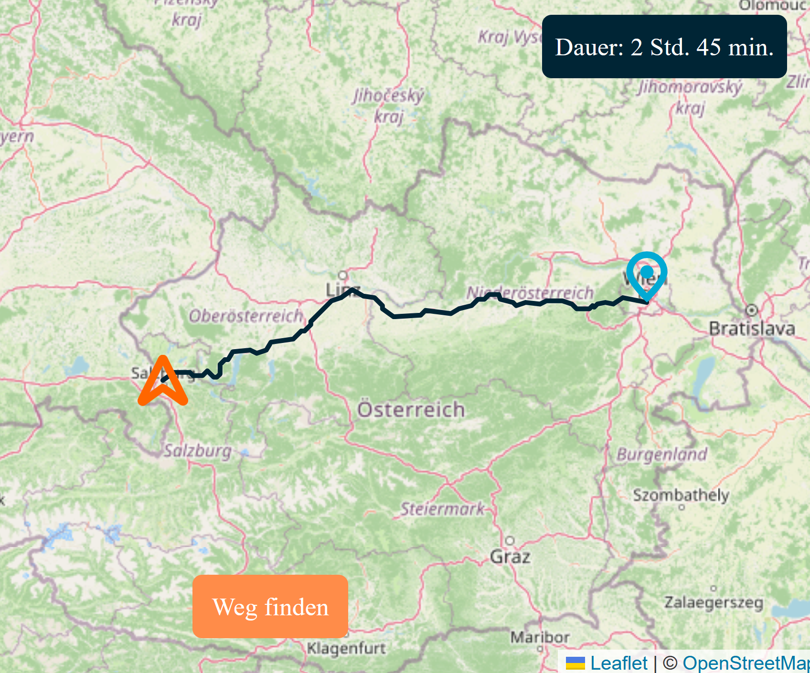

<div align="center">
    <h1>Strassen</h1>
</div>

<div align="center">
    <p>
        
    </p>
    <p>
        This project provides an API and a frontend for routing in Austria. You
        input two points in Austria and you get the fastest route between them.
    </p>
    <p>
            
    </p>
</div>


## Features

- **Fastest route:** You provide two points and you are given the fastest route between them. 
- **Open Austrian road data:** The backend uses open Austrian road data.
- **Cache data:** The data is only loaded on first startup. Afterwards it is loaded from a cached file.

## Running it locally

To run this project you need:
- [python (3.13)](https://www.python.org/downloads/release/python-31316/)
- [git](https://git-scm.com/install/windows)
- [node](https://nodejs.org/en/download)

Download street data:
You can download the GeoPackage file for all streets [here](https://www.data.gv.at/datasets/3fefc838-791d-4dde-975b-a4131a54e7c5). You wnat the "_B - GIP Network: Basisnetz_".
Because this file contains all streets including bike paths and hiking trails you need to filter for relevant streets.
I only used streets where _edge_category_ is _A, B, BS, G, GI, GS, GW, H, I, IO, KR, L, LD, LR, LS, P, PO, R, S, SD, SS, SW, VS_
If you only want important streets you can filter for _edge_category_ in _A, B_
When exporting make sure to name the layer _strassen_

To compile and run the website run the following:
```
git clone https://github.com/fritl/strassen.git
```

Then copy your data to _backend/data/strassen.gpkg_ and run:
```
cd strassen
uv run fastapi dev
```

Open a second terminal and navigate to the `strassen` directory and run:
```
cd frontend/
npm i
npm run dev
```
Then just open [http://localhost:5173](http://localhost:5173)

## How it works

The data is loaded using [fiona](https://pypi.org/project/fiona/). Only the
relevant informations are picked and built into a graph. To find the shortest
route dijkstra is run on that graph.

Dijkstra needs the node ids but on the frontend you want to move the start and
end position freely. To find the nearest node from a coordinate a _BallTree_
from [sklearn](https://scikit-learn.org/stable/) is used.

The frontend uses [leafletjs](https://leafletjs.com/) to draw the map.

## Possible improvements

Working with street data is not easy. Altough it is really accesible and
complete processing requires careful consideration. Therefore I found some
possible improvements that could be made when revisiting this project or implementing it again:

- **Impossible routes:** Some streets in the dataset are not accesible for
  cars. This is accounted for when loading the data but for some reason some
  routes still use streets that cars can't drive on.
- **Impossible turns:** The backend just assumes turning is allowed everywhere
  which is not the case. There is data for this but implementing this is
  something I hold for the future.
- **Path finding:** While dijkstra works it is not the fastest. There are much
  better algorithms to find the shortest path and with them the path finding
  time could be reduced.
